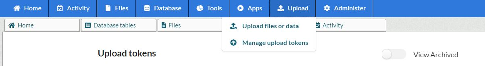
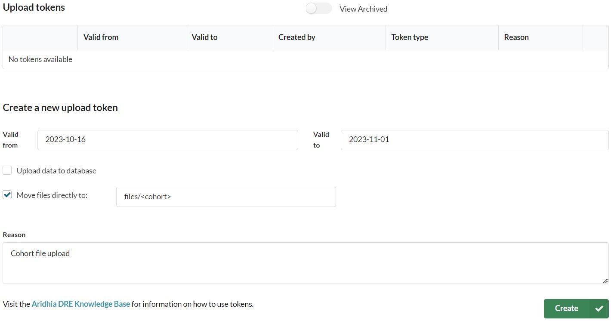
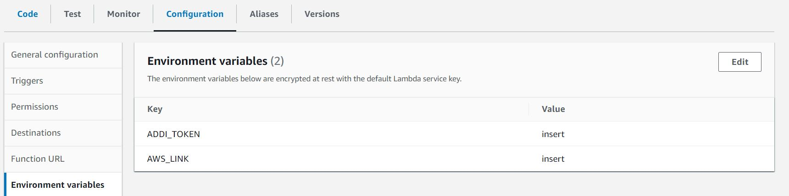

# ADCS (Alzheimer's Disease Curation Studio) Upload

## Overview

This is a sample script on AWS lambda that would allow you to push data to the ADCS workspace. The script is written in Python 3.10 and uses the boto3 library to interact with AWS services. The script is designed to be run on AWS Lambda, and use AWS temporary directories.

## Setup

### ADCS Token Creation

#### Step 1: Go to Upload/Manage Upload Tokens



#### Step 2: Click on Create New Upload Token



> **Note:** Ensure the spelling of the path is consistent with your directory structure. The path is case sensitive "files/" is not the same as "Files/".

#### Step 3: Copy the token and save it in a secure location

#### Step 4: AzCopy Installation

You will download AzCopy for Linux as AWS runs its Lambda function on a Linux environment, use this link or the most recent version on google.

<https://aka.ms/downloadazcopy-v10-linux>

Remember the location of your download as we will be using it later.

#### Step 5: AWS S3 Setup

In AWS we will first start by setting up an S3 bucket.  

Head over to the S3 and create a bucket (azcopy-folder).

Create a folder under it called “logs/”

In this bucket, please upload the linux azcopy file that you downloaded from windows.

#### Step 6: AWS Lambda Setup

Next, create a Lambda function with the most recent python runtime.

Make sure to use x86_64 architecture, or the Linux architecture that you chose for your AzCopy file.

Once created, head to IAM, look for your function’s role, and add AmazonS3FullAccess permissions.

Come back to your function, and add the python script **lambda_function.py** to the function.

#### Step 7: Environment Variables

Inside lambda, go to the configuration tab, and edit the environment variables.



#### Step 8: AWS EventBridge Setup (Optional)

For automatic scheduling of the process, please head over to EventBridge, and set a schedule for the execution of your lambda function.

Make sure to use {} as your input JSON, since we are not passing any parameters to the function.

Remember that the token needs to be manually updated depending on the expiration date.

# Dependencies
- [stream-zip](https://stream-zip.docs.trade.gov.uk/)
- [smart_open](https://github.com/piskvorky/smart_open)

# AWS CDK
## Setup
[Install AWS CDK](https://docs.aws.amazon.com/cdk/v2/guide/getting_started.html#getting_started_install)

Bootstrap the AWS CDK stacks. Instructions are on the same page.

Also set up credentials for AWS.

## Deploying
```sh
cd cdk
cdk deploy
```

The following AWS Lambda variables still need to be manually configured
- ADDI_TOKEN: The file upload token for ADDI

## Building notes
For dependencies, the stack installs dependencies to `cdk/build-acds-upload` and copies `lambda_function.py` to the same folder.
That folder is used as the Lambda package.

The folder is not cleared each build. If dependencies are removed,
make sure to delete the folder.

If native library dependencies are used (`numpy` for example) that depend on architecture,
the build must be done on the same architecture as the Lambda runtime.